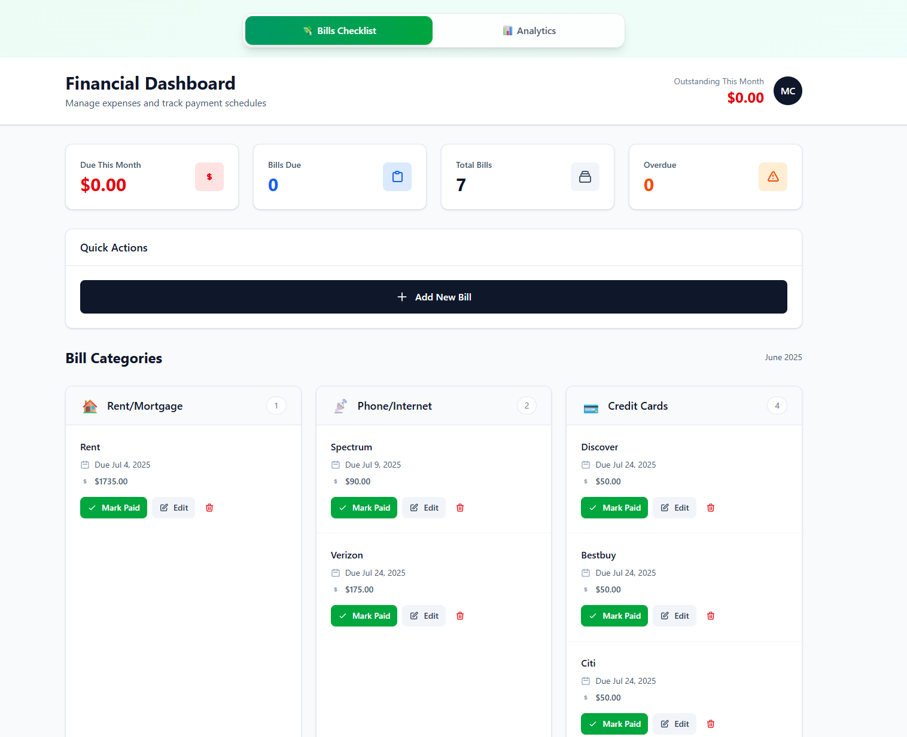
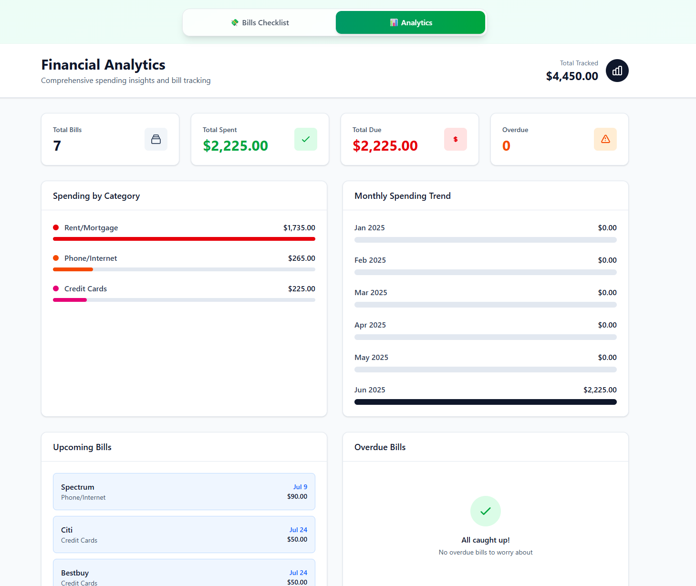

# 💸 BillsPaid - Smart Bill Management App

<div align="center">


**A beautiful, modern web application for tracking and managing your bills with intelligent analytics**

[🚀 Features](#-features) • [💻 Tech Stack](#-tech-stack) • [⚡ Quick Start](#-quick-start) • [📱 Usage](#-usage) • [🐳 Docker](#-docker-support)

</div>

---

## 🌟 Overview

BillsPaid is a comprehensive bill management application that helps you keep track of your monthly expenses, due dates, and payment history. With its intuitive interface and powerful analytics, you'll never miss a payment again!

<div align="center">
  
  
</div>

## 🚀 Features

### 💸 Bill Management
- **Smart Bill Tracking** - Add, edit, and organize all your bills in one place
- **Due Date Reminders** - Never miss a payment with visual due date indicators
- **Category Organization** - Organize bills by categories (utilities, subscriptions, etc.)
- **Payment History** - Track all your payments with detailed records

<div align="center">
  
  <p><em>Intuitive bill management interface with easy-to-use controls</em></p>
</div>

### 📊 Analytics Dashboard
- **Spending Insights** - Visualize your spending patterns and trends
- **Category Breakdown** - See where your money goes by category
- **Payment Analytics** - Track payment history and patterns
- **Monthly Reports** - Comprehensive monthly spending summaries

<div align="center">
  
  <p><em>Comprehensive analytics dashboard with spending insights and trends</em></p>
</div>

### 🎨 User Experience
- **Modern UI/UX** - Beautiful gradient design with smooth animations
- **Responsive Design** - Works perfectly on desktop, tablet, and mobile
- **Real-time Updates** - Instant updates without page refreshes
- **Intuitive Navigation** - Easy-to-use tabbed interface

## 💻 Tech Stack

| Technology |
|------------|
| **Next.js** |
| **TypeScript**| 
| **Prisma** |
| **SQLite** |


## ⚡ Quick Start

### Prerequisites
- Node.js 18+ 
- npm, yarn, pnpm, or bun

### Installation

1. **Clone the repository**
   ```bash
   git clone https://github.com/MK732/AreBillsPaid.git
   cd billspaid
   ```

2. **Install dependencies**
   ```bash
   npm install
   # or
   yarn install
   # or
   pnpm install
   ```

3. **Set up the database**
   ```bash
   npx prisma generate
   npx prisma db push
   ```

4. **Start the development server**
   ```bash
   npm run dev
   # or
   yarn dev
   # or
   pnpm dev
   # or
   bun dev
   ```

5. **Open your browser**
   Navigate to [http://localhost:3000](http://localhost:3000) to see the application.

## 📱 Usage

### Adding Bills
1. Navigate to the **Bills Checklist** tab
2. Click "Add New Bill" button
3. Fill in bill details (name, amount, due date, category)
4. Save and start tracking!

### Recording Payments
1. Find your bill in the checklist
2. Click the payment button
3. Enter payment amount and date
4. Your payment history is automatically updated

### Viewing Analytics
1. Switch to the **Analytics** tab
2. Explore your spending patterns
3. View category breakdowns
4. Analyze payment trends

## 🐳 Docker Support

The application includes Docker support for easy deployment:

```bash
# Build and run with Docker Compose
docker-compose up --build

# Or build manually
docker build -t billspaid .
docker run -p 3000:3000 billspaid
```

## 📁 Project Structure

```
billspaid/
├── app/                 # Next.js App Router
│   ├── globals.css     # Global styles
│   ├── api/            # API routes
│   ├── layout.tsx      # Root layout
│   └── page.tsx        # Home page
├── components/         # React components
│   ├── Analytics.tsx   # Analytics dashboard
│   └── BillChecklist.tsx # Bill management
├── prisma/            # Database
│   ├── schema.prisma  # Database schema
│   └── dev.db         # SQLite database
├── public/            # Static assets
└── ...config files
```

## 🛠️ Development

### Database Operations
```bash
# Generate Prisma client
npx prisma generate

# Push schema changes
npx prisma db push

# View database
npx prisma studio
```

### Building for Production
```bash
npm run build
npm start
```

---

<div align="center">


*Keep your bills organized, your payments on time, and your finances under control!*

</div>
